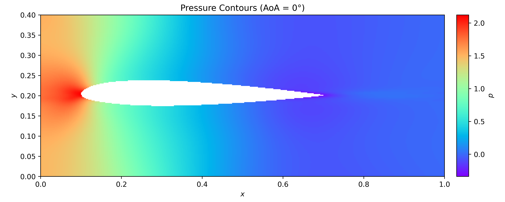
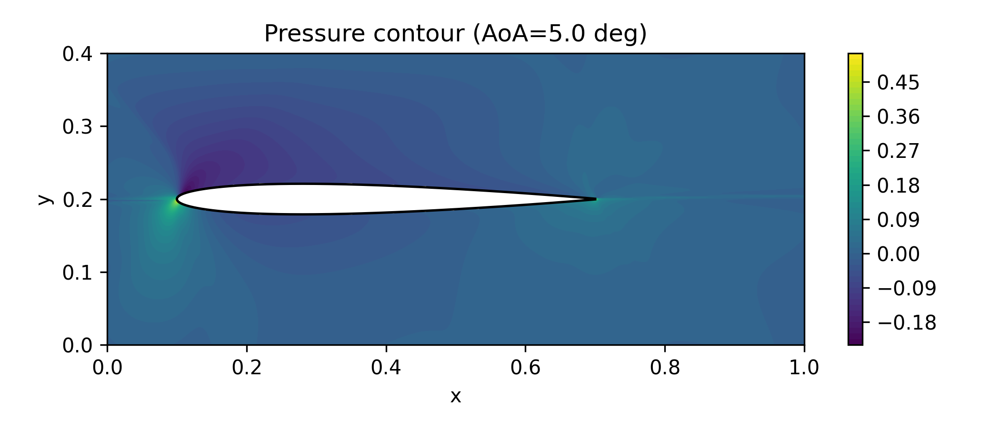

# Airfoil Flow: PINN and Potential-Flow Modeling

Numerical modeling of two-dimensional incompressible flow over NACA airfoils using physics-informed neural networks (PINNs) and a MATLAB source-distribution potential-flow method.

## Project Overview

This project investigates airfoil flow through three related cases:

| Case | Airfoil    | Flow condition   | Method                            |
| ---- | ---------- | ---------------- | --------------------------------- |
| A    | NACA 23018 | α = 0°, Re = 100 | Viscous PINN                      |
| B    | NACA 0009  | α = 5°           | Potential-flow PINN               |
| C    | NACA 0009  | α = 0°, U∞ = 1   | MATLAB source-distribution method |

The PINN models use the governing equations and boundary conditions directly in the training loss. The MATLAB model provides a simpler numerical comparison for inviscid potential flow.

## Governing Equations

For steady incompressible flow:

$$
\nabla \cdot \mathbf{u}=0
$$

$$
(\mathbf{u}\cdot\nabla)\mathbf{u}
=
-\nabla p+\frac{1}{Re}\nabla^2\mathbf{u}
$$

The PINN loss combines the governing-equation residuals with the boundary, pressure-gauge, and trailing-edge constraints:

$$
\mathcal{L}
=
w_f\mathcal{L}_{PDE}
+
w_b\mathcal{L}_{boundary}
+
w_g\mathcal{L}_{gauge}
+
w_K\mathcal{L}_{Kutta}
$$

## NACA 23018 at Zero Angle of Attack

The first model considers low-Reynolds-number viscous flow around a cambered NACA 23018 airfoil.



Reported aerodynamic coefficients:

| Coefficient          | PINN result | Interpretation                                                  |
| -------------------- | ----------: | --------------------------------------------------------------- |
| Lift coefficient, CL |     0.29789 | Close to the selected reference value of approximately 0.30     |
| Drag coefficient, CD |     2.97713 | Unphysically high and not considered a reliable drag prediction |

The lift estimate is reasonable for the selected reference, but the drag result is sensitive to surface normals, predicted stresses, scaling, and numerical force integration.

## NACA 0009 at 5° Angle of Attack

The corrected potential-flow PINN includes:

* Far-field velocity constraints
* A pressure-gauge point
* Robust trailing-edge point selection
* A Kutta condition
* A learnable circulation parameter



Reported results:

| Quantity             |           Value |
| -------------------- | --------------: |
| Lift, L              | 4.625497 × 10⁻² |
| Drag, D              | 4.530762 × 10⁻³ |
| Lift coefficient, CL |       0.1541832 |
| Drag coefficient, CD |       0.0151025 |

The positive lift is qualitatively consistent with the positive angle of attack. The small nonzero drag is interpreted as a numerical residual because ideal potential flow predicts zero pressure drag.

## MATLAB Potential-Flow Model

The MATLAB script uses multiple symmetric rows of regularized point sources. Their strengths are obtained through weighted and regularized least squares while approximately enforcing the no-penetration condition:

$$
\mathbf{V}\cdot\mathbf{n}\approx0
$$

Increasing the target source count from 60 to 480 reduced the maximum normal-velocity residual from approximately \(1.22\times10^{-1}\) to \(9.09\times10^{-3}\).

The model also examines:

* Numerical independence with respect to source count
* Airfoil-thickness sensitivity
* Velocity-potential contours
* Streamfunction contours
* Lift and residual drag at zero incidence

## Repository Contents

* `notebooks/` — final PINN notebooks for the two airfoil cases
* `matlab/` — commented MATLAB potential-flow script
* `data/` — NACA airfoil coordinate files
* `models/` — saved PyTorch model parameters
* `results/` — flow fields, loss curves, and MATLAB figures
* `docs/` — English and Persian project reports
* `requirements.txt` — Python dependencies

## Running the PINN Notebooks

Install the Python dependencies:

```bash
pip install -r requirements.txt
```

Open the desired notebook in Jupyter and run its cells. Training can be computationally expensive, so saved model parameters and exported results are included for inspection without retraining.

## Running the MATLAB Model

Load the NACA 0009 coordinate file as the variable `data`, then run the MATLAB script:

```matlab
data = readmatrix('data/naca0009-coordinates.txt');
run('matlab/potential-flow-airfoil.m');
```

## Limitations

This repository is an academic numerical project, not a validated CFD solver. The main limitations are:

* High sensitivity of force coefficients to surface integration
* Incomplete PINN convergence in some cases
* Numerical residual drag in the potential-flow models
* Lack of independent experimental or CFD validation

The inaccurate drag result for the first case is retained and documented rather than presented as a physically reliable prediction.

## Reports

* [English project report](docs/airfoil-flow-pinn-report-en.pdf)
* [Persian project report](docs/airfoil-flow-pinn-report-fa.pdf)
